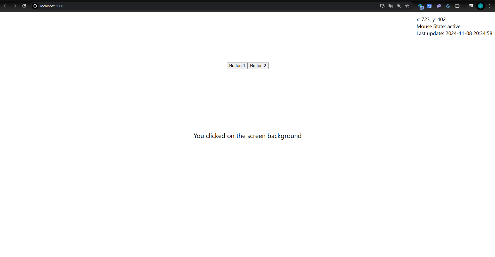
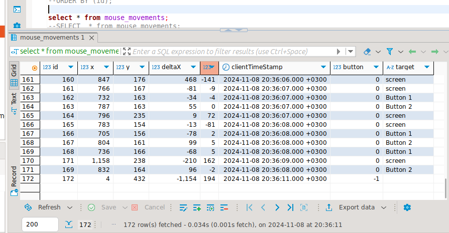
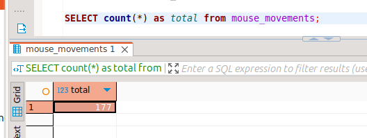
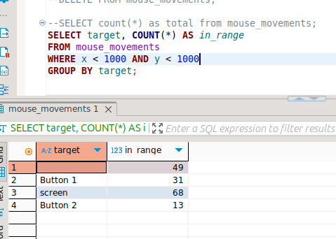
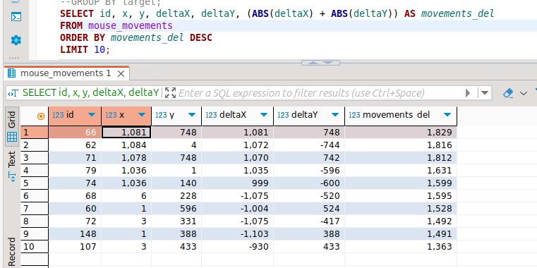

# Проект: Веб-приложение для отслеживания движений мыши

## План

1. Проект – фронт и бэк
2. Настройка БД
3. Тестирование

## Проект. Бэк

Задача бэкенда – отправлять данные в БД.

### Используемые библиотеки:
- **FastAPI** – веб-приложение, обработка HTTP-запросов.
- **Pydantic** – используется для валидации данных, поступающих в запросах.
- **SQLAlchemy** – используется для взаимодействия с базой данных ClickHouse + описание таблицы.
- **ClickHouse SQLAlchemy** – специализированная библиотека для работы с ClickHouse через SQLAlchemy.
- **Datetime** – преобразует строку временной метки в объект `datetime` для дальнейшего сохранения в базу данных.
- **fastapi.middleware.cors.CORSMiddleware** – используется для настройки CORS (иначе не будет работать).

## Логика работы

### 1. Подключение к FastAPI:
- Создается экземпляр FastAPI.
- Включен middleware для работы с CORS (Cross-Origin Resource Sharing), что позволяет принимать запросы с различных доменов.

### 2. Подключение к ClickHouse:
- Задается строка подключения к базе данных ClickHouse с использованием URL, включающего логин и пароль.
- Создается движок (engine) и метаданные (metadata) для работы с ClickHouse через SQLAlchemy.

### 3. Определение структуры таблицы:
- Создается таблица `mouse_movements` для хранения данных о движениях мыши.
- Для таблицы используются следующие поля:
  - `id` (первичный ключ),
  - `x` и `y` (координаты мыши),
  - `deltaX` и `deltaY` (изменения координат),
  - `clientTimeStamp` (временная метка),
  - `button` (информация о нажатой кнопке мыши),
  - `target` (целевой элемент).
- Указывается, что таблица будет использовать движок `MergeTree` с сортировкой по полю `id`.

### 4. Создание сессии:
- Создается сессия для взаимодействия с базой данных через SQLAlchemy и ClickHouse SQLAlchemy.

### 5. Модель данных для валидации:
- Создается модель `MouseMovement` с использованием Pydantic для валидации входных данных.
- Эта модель принимает информацию о движении мыши, включая координаты, изменения, временную метку, информацию о кнопке и целевом элементе.

### 6. Обработка POST-запроса:
- В FastAPI создается эндпоинт `/upload-mouse-movement`, который обрабатывает POST-запросы с данными о движении мыши.
- В теле запроса ожидаются данные, соответствующие модели `MouseMovement`.
- Внутри функции выполняется следующее:
  - Преобразование строки с временной меткой в объект `datetime`.
  - Получение текущего максимального значения `id` из таблицы и добавление 1 для нового значения.
  - Формирование запроса на вставку нового движения мыши в таблицу с присвоением уникального `id` и данными из запроса.
  - Выполнение запроса на вставку данных в базу.
- Если все прошло успешно, возвращается статус "Data inserted successfully". В случае ошибки генерируется исключение с кодом 500 и сообщением об ошибке.

## Реализация

Реализация представлена в файле `server/main.py`.

---
## Проект. База данных

```sql
CREATE TABLE mouse_movements (
 id UInt32,
 x Int16,
 y Int16,
 deltaX Int16,
 deltaY Int16,
 clientTimeStamp DateTime('Europe/Moscow'),
 button Int8,
 target String
)
ENGINE = MergeTree()
ORDER BY (id);
```
---
## Проект. Фронт

В качестве фронта был выбран **ReactJS** с использованием **TypeScript**. В React приложении один файл отвечает за работу с координатами мыши, состоянием мыши, обработкой кликов, отображением кнопок и кругов на экране, а также за отправкой данных на сервер.

### 1. Инициализация состояний:
В приложении используется несколько состояний с помощью хука `useState`:
- **coordinates**: Хранит текущие координаты мыши (x, y).
- **previousCoordinates**: Хранит предыдущие координаты мыши (для вычисления изменений).
- **mouseState**: Состояние мыши, которое может быть либо "active" (активное состояние), либо "calm" (бездействие).
- **buttonText**: Хранит текст, который отображается при нажатии на кнопку.
- **clickPosition**: Хранит координаты, где был совершен клик.
- **clickInfo**: Хранит информацию о том, где был совершен клик (на кнопке или на фоне).
- **lastUpdateTime**: Хранит время последнего обновления координат.

### 2. Обработчики событий:
- **handleMouseMove**: Этот обработчик отслеживает движения мыши по экрану и обновляет состояние `coordinates`, а также меняет состояние `mouseState` на "active", если оно не было активным.
- **handleMouseIdle**: Этот обработчик запускается, если мышь не двигается в течение определенного времени (1 секунда), и меняет состояние мыши на "calm".
- **handleButtonClick**: Обработчик кликов по кнопкам, который обновляет текст на кнопке (`buttonText`) и показывает информацию о том, где был совершен клик.
- **handleClick**: Обработчик кликов по экрану, который:
  - Обновляет координаты клика.
  - Вычисляет изменения координат (дельта).
  - Определяет, был ли клик на кнопке или на фоне экрана.
  - Отправляет информацию о клике на сервер через `fetch`.
  - Отображает круг в месте клика.
  - Обновляет время последнего обновления.

### 3. Таймер бездействия:
С помощью `useEffect` устанавливается таймер, который запускается при каждом движении мыши. Если мышь не двигается в течение 1 секунды, состояние мыши меняется на "calm".

### 4. Отправка данных на сервер:
В функции обработчика кликов (`handleClick` и в `useEffect` для бездействия мыши) данные о текущих координатах и информации о движении мыши отправляются на сервер через `fetch`:
- Данные отправляются в формате JSON, включая координаты мыши, изменения координат (дельта), временную метку (`clientTimeStamp`), информацию о кнопке и целевом элементе (экран или кнопка).

### 5. Отображение UI:
- **Координаты и состояние мыши**: В правом верхнем углу экрана отображаются текущие координаты мыши и состояние мыши (активно или в состоянии покоя).
- **Время последнего обновления**: Отображается время последнего обновления координат.
- **Кнопки**: Две кнопки, расположенные в верхней части экрана, могут быть нажаты для обновления информации о клике.
- **Информация о клике**: Когда происходит клик, отображается текст с информацией о том, где был совершен клик (на кнопке или на фоне).
- **Круг при клике**: При клике на экран или кнопку отображается полупрозрачный круг в месте клика.

### 6. Удаление круга после клика:
Круг в месте клика исчезает через 500 миллисекунд, создавая эффект затухания.

### 7. Управление событиями с `useEffect`:
Все слушатели событий и таймеры очищаются при размонтировании компонента, чтобы избежать утечек памяти и ненужных операций.

### 8. Интерфейс пользователя:
В интерфейсе:
- Пользователь видит координаты мыши, текущее состояние мыши (активное или спокойное) и время последнего обновления.
- Две кнопки, которые при нажатии изменяют текст на экране, показывая информацию о клике.
- В месте клика отображается круг, который исчезает через короткое время.

### Пример работы:
- Когда пользователь двигает мышь, экран обновляет координаты и состояние мыши.
- При клике на экран или кнопку появляется информация о месте клика.
- Все данные о координатах и движении мыши отправляются на сервер для обработки.

Реализацию можно детально посмотреть в папке `front`.

## Тестирование




## Анализ
1) Общее количество движений мыши 
```sql
SELECT COUNT(*) AS total_mouse_movements FROM mouse_movements;
```



2) Количество движений мыши в диапазоне и по таргету
```sql
SELECT target, COUNT(*) AS in_range
FROM mouse_movements
WHERE x < 1000 AND y < 1000
GROUP BY target;
```



3) Наибольшая дельта
```sql
SELECT id, x, y, deltaX, deltaY, (ABS(deltaX) + ABS(deltaY)) AS movement_magnitude
FROM mouse_movements
ORDER BY movement_magnitude DESC
LIMIT 10;
```

